# System Preference

### AutoBoot (Since the 2016)

* Enable

  ```shell
  sudo nvram AutoBoot=%03
  ```

* Eisable

  ```shell
  sudo nvram AutoBoot=%00
  ```

  

### General

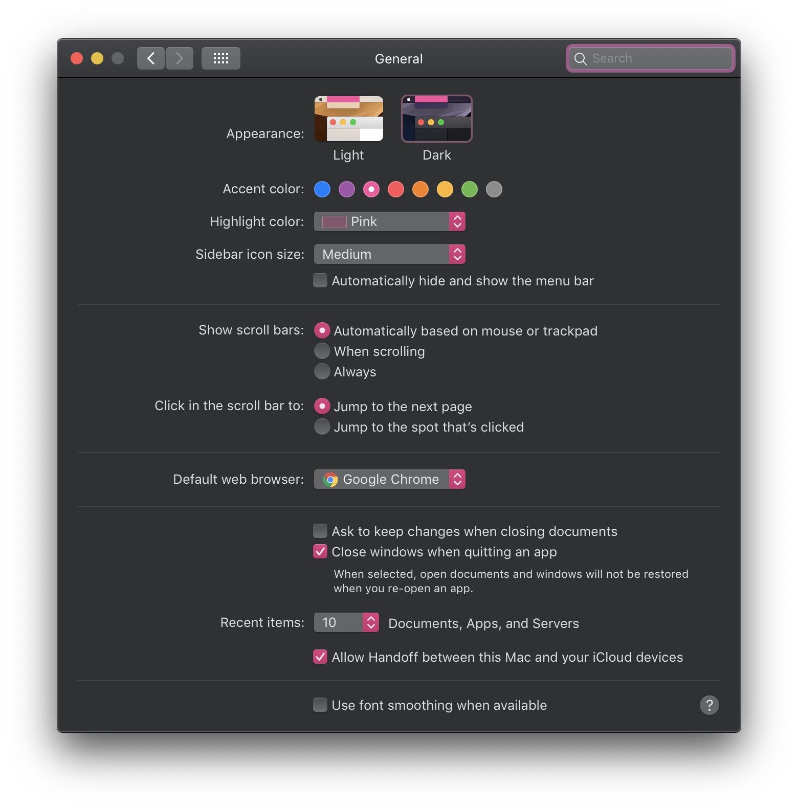

- Appearance: Dark

- Accent color: Pink

- Highlight color: Pink

- Sidebar icon size: Medium

- Automatically hide and show the menu bar: false

  

- Show scroll bars: Automatically based on mouse or trackpad

- Click in the scroll bar to: Jump to the next page

  

- Default web browser: Google Chrome

  

- Ask to keep changes when closing documents: false

- Close windows when quitting an app: true

- Recent items: 10

- Allow Handoff between this Mac and your iCloud devices: true

  

- Use font smoothing when available: false


### Desktop & Screen Saver

#### Desktop

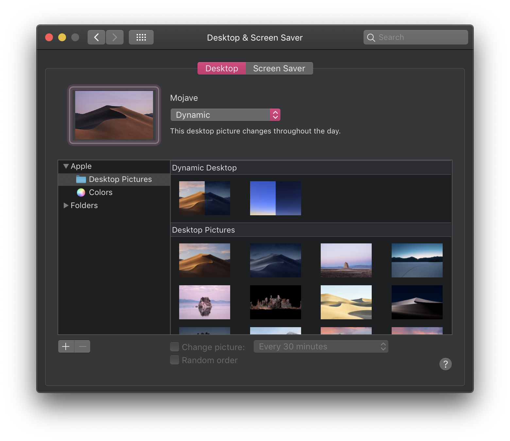

- Dynamic


#### Screen Saver

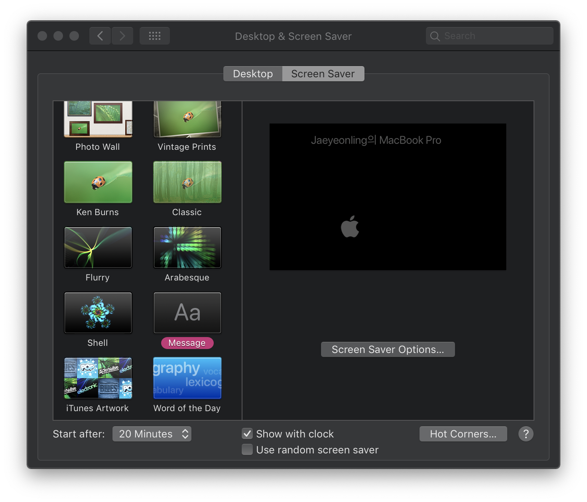

* Message
* Start after: 20 Minutes
* Show with clock: true
* Use random screen saver: false


### Dock


* Size: 30%
* Magnification: true / 100%
* Position on screen: Bottom
* Minimize windows using: Genie effect
* Prefer tabs when opening documents: In Full Screen Only
* Double-click a window’s title bar to: true / zoom
* Minimize windows into application icon: true
* Animate opening applications: true
* Automatically hide and show the Dock: true
* Show indicators for open applications: true
* Show recent applications in Dock: false


### Mission Control

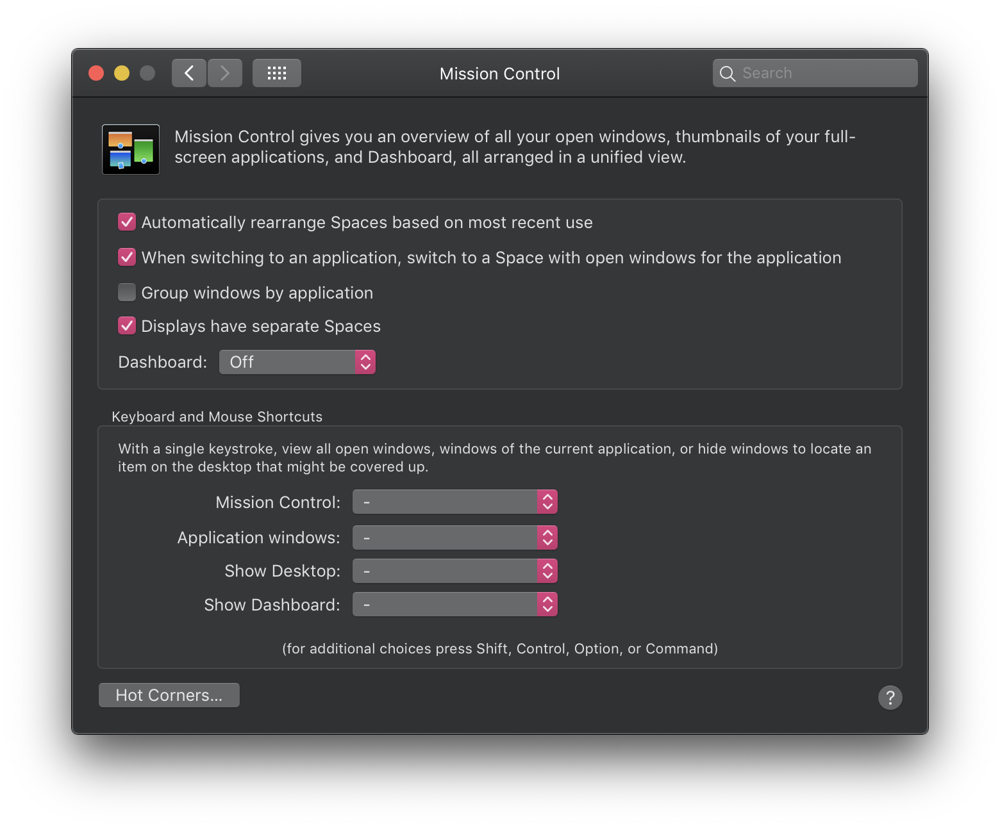

- Automatically rearrange Spaces based on most recent use: true

- When switching to an application, switch to a Space with open windows for the application: true

- Group windows by application: false

- Displays have separate Spaces: true

- Dashboard: Off

  

- Keyboard and Mouse Shortcuts

- Mission Control: -

- Application Windows: -

- Show Desktop: -

- Show Dashboard: -


### Language & Region

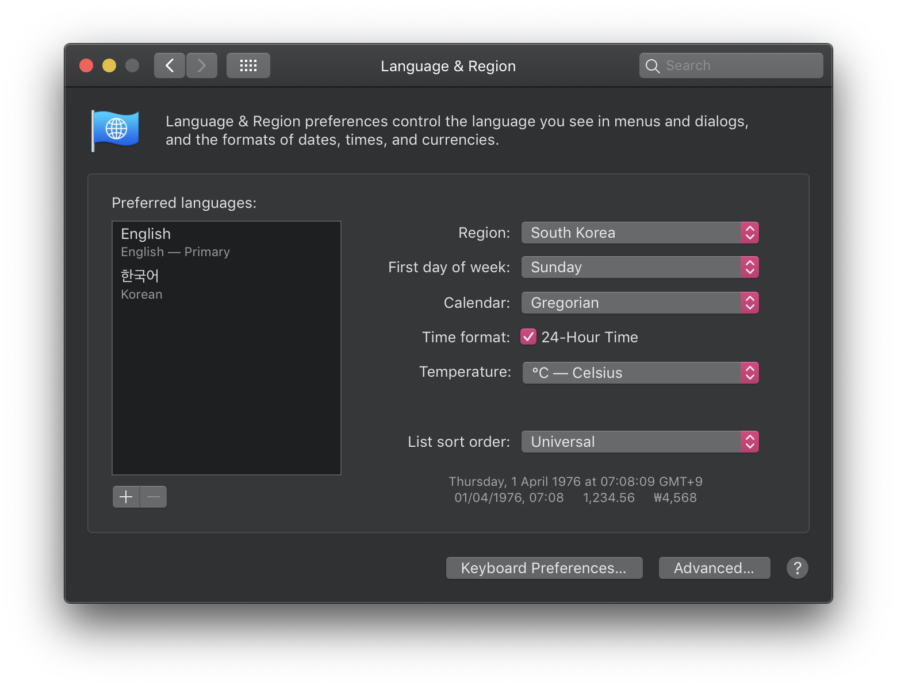

- Preferred language
  - English (Primary)
  - Korean

- Region: South Korea
- First day of week: Sunday
- Calendar: Gregorian
- Time format: true / 24-Hour Time
- Temperature: Celsius
- List sort order: Universal


### Security & Privacy

#### General

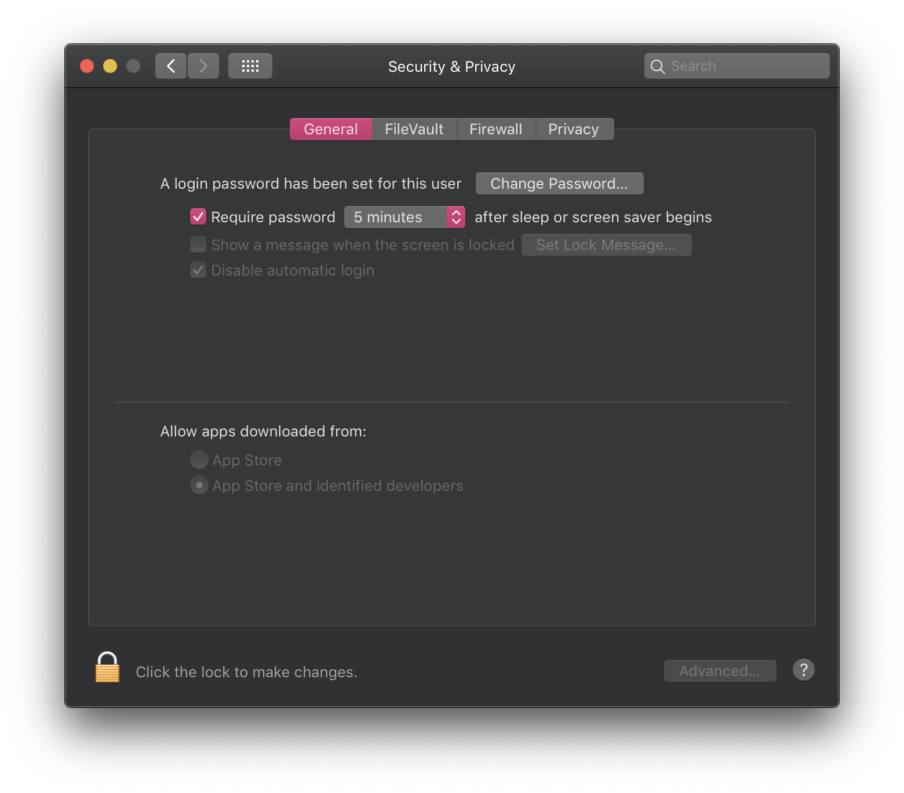

- Require password after sleep on screen saver begins: true / 5 minutes

- Show a message when the screen is locked: false

- Disable automatic login: false

  

- Allow apps downloaded from: App Store and identified developers

#### FileVault: Off


#### Firewall: On


### Spotlight

#### Search Results

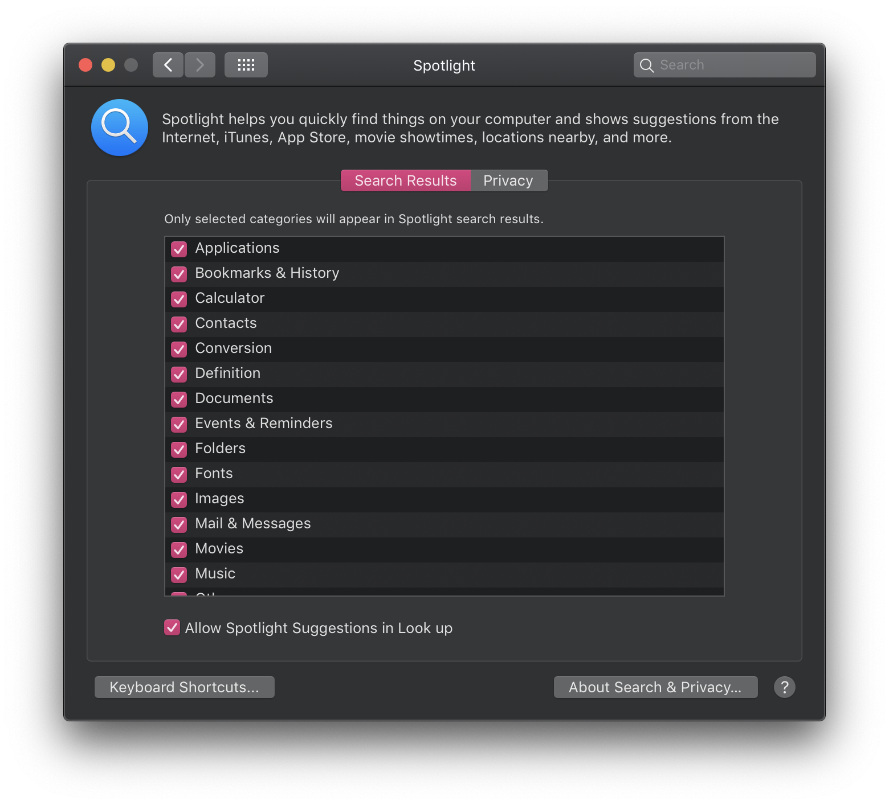

- Allow Spotlight Suggestions in Look up: true


### Notifications

#### Do Not Disturb


##### Turn on Do Not Disturb: false

- From: 22:00
- To: 07:22
- When the display is sleeping: false
- When mirroring to TVs and projectors: true

##### When Do Not Disturb is turned on

- Allow calls from everyone: false
- Allow repeated calls: false

##### Notification Center sort order: Recents


### Displays

#### Built-in Retina Display

##### Display


- Resolution: Scaled
- More Space
- Brightness: 80%
- Automatically adjust brightness: true
- True Tone: true

###### AirPlay Display: Off

###### Show mirroring options in the menu bar when available: true


##### Arrangement


###### Mirror Displays: false


##### Color


###### Show profiles for this display only: false


##### Night Shift

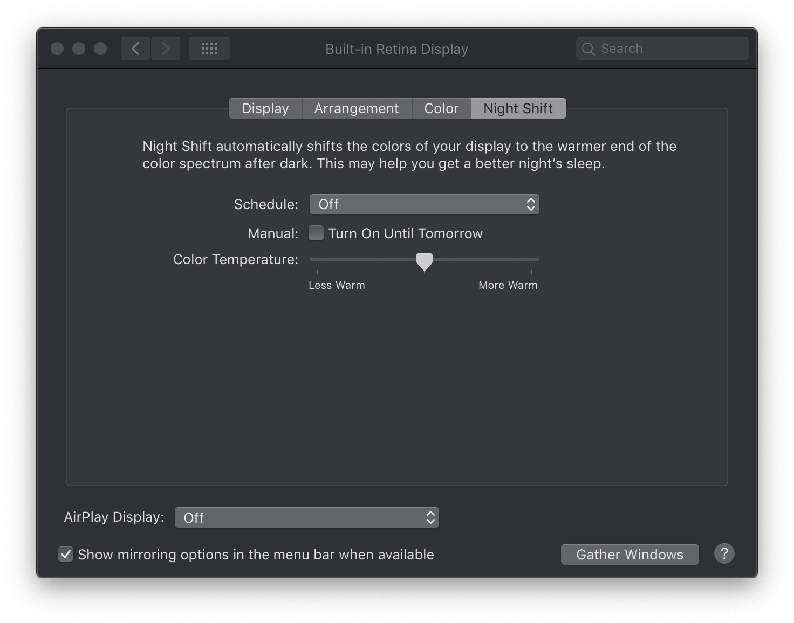

- Schedule: Off
- Manual(Turn On Until Tomorrow): false
- Color Temperature: Middle Warm


### Energy Saver

- Automatic graphics switching: true
- Show battery status in menu bar: true

#### Battery


- Turn display off after: 15 minutes
- Put hard disks to sleep when possible: true
- Slightly dim the display while on battery power: false
- Enable Power Nap while plugged into a power adapter: false

#### Power Adapter


- Turn display off after: 3 hours
- Preevent computer from sleeping automatically when the display is off: false
- Put hard disks to sleep when possible: true
- Walk for Wi-Fi network access: true
- Enable Power Nap while plugged into a power adapter: true

### Keyboard

#### Keyboard

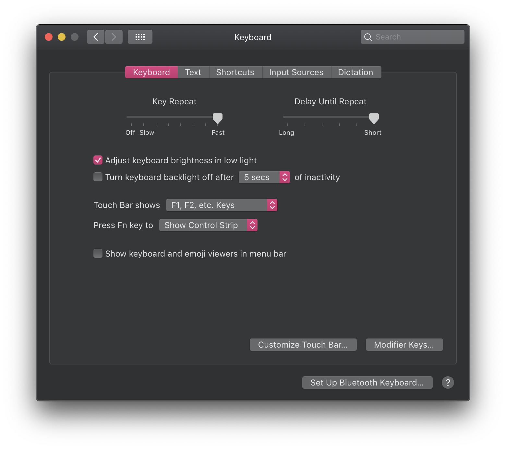

- Key Repeat: Fast
- Delay Until Repeat: Short
- Adjust keyboard brightness in low light: true
- Turn keyboard backlight off after of inactivity: false
- Touch Bar shows: F1, F2, etc. Keys
- Press Fn key to: Show Control Strip
- Show keyboard and emoji viewers in menu bar: false

##### Customize Touch Bar...


##### Modifier Keys...

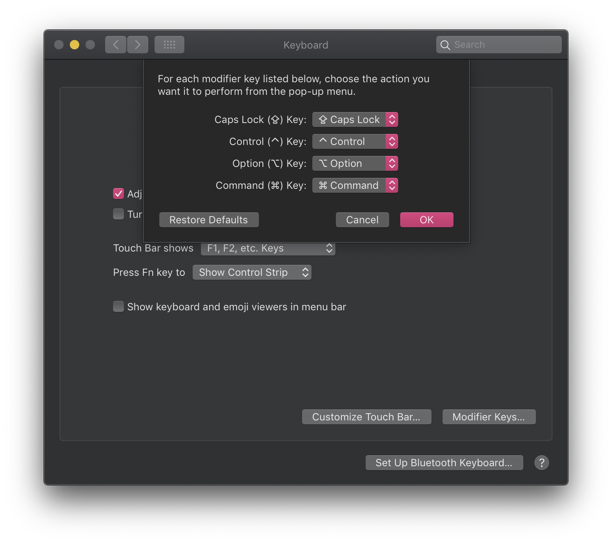

- Caps Lock Key: Caps Lock
- Control Key: Control
- Option Key: Option
- Command Key: Command


##### Text


- Correct spelling automatically: false

- Capitalize words automatically: false

- Add period with double-space: false

- Touch Bar typing suggestions: false

  

- Spelling: Automatic by Language

  

- Use smart quotes and dashes: false

- for Double Quotes: "abc"

- for Single Quotes: 'abc'


##### Shortcuts

- Text boxes and lists only: check

###### Launchpad & Dock


###### Mission Control

 

###### Keyboard


###### Input Sources


###### Screenshots


###### Services


###### Spotlight


###### Accessibility


###### App Shortcuts


###### Function Keys

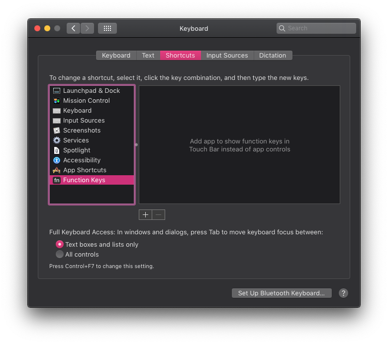

##### Input Sources


- Show Input menu in menu bar: true
- Use the 한/영 key to switch to and from ABC: false
- Automatically switch to a document's input source: false


##### Dictation

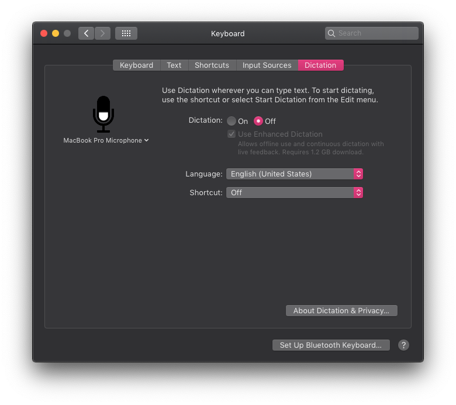

- Dictation: Off
- Language: English (United States)
- Shortcut: Off


### Mouse


### Trackpad

#### Point & Click


- Look up & data detectors: false / Tap with three fingers

- Secondary click: true / Click or tap with two fingers

- Tap to click: true / Tap with one finger

  

- Click: Light

- Tracking speed: Fast

  

- Force Click and haptic feedback: false

####Scroll & Zoom


* Scroll direction Natural: true / Content tracks finger movement
* Zoom in or out: true / Pinch with two fingers
* Smart zoom: false / Double-tap two fingers
* Rotate: true / Rorate with two fingers

####More Gestures


* Swipe between pages: true / Scroll left or right with two fingers
* Swipe between full-screen apps: true / Swipe left or right with four fingers
* Notification Center: false / Swipe left from the right edge with two finger
* Mission Control: true / Swipe up with four fingers
* App Expose: true / Swipe down with four fingers
* Launchpad: true / Pinch with thumb and three fingers
* Show Desktop: true / Spread with thumb and three fingers

#### 

### Printers & Scanners


### Sound

- Output volume: 50%
- Mute: false
- Show volume in menu bar: true

#### Sound Effects


- Play sound effects through: MacBook Pro Speakers
- Alert volume: 100%
- Play user interface sound effects: true
- Play feedback when volume is changed: false

#### Output

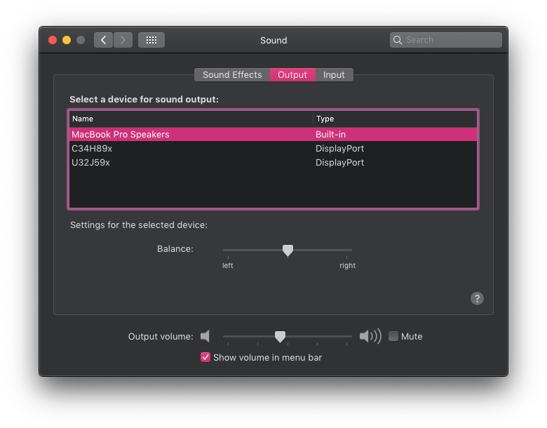

- Balance: 50%

#### Input

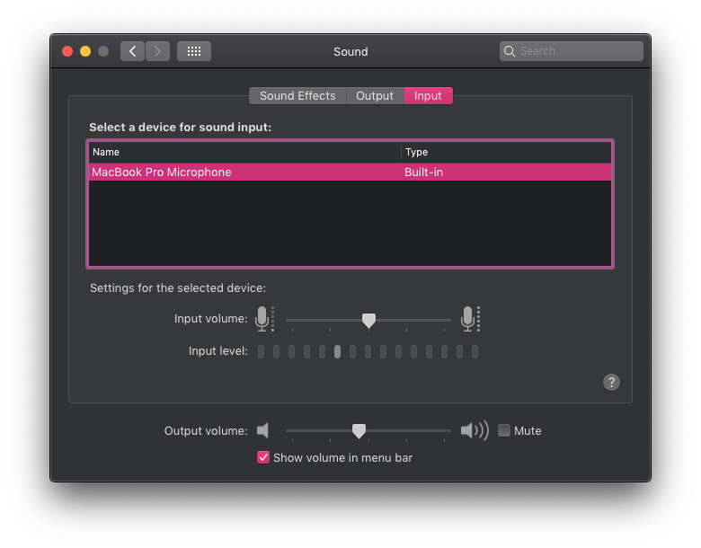

- Input volume: 50%
